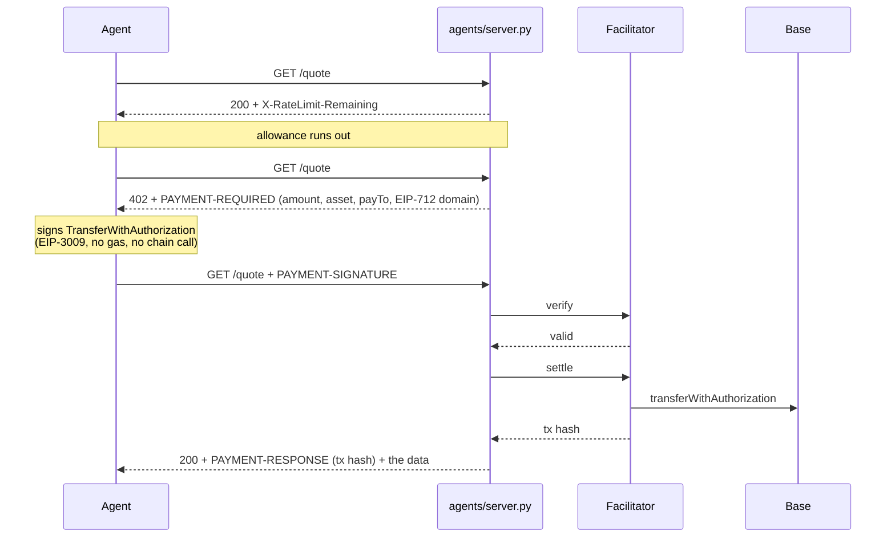
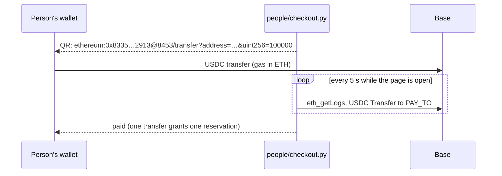

# USDC payments on Base, for AI agents and for people

Two ways to get paid in USDC on Base mainnet, extracted from a product that runs
them in production:

1. **Agents pay per request over x402.** An endpoint is free up to a daily
   allowance and, past that line, answers **402 with a payment challenge instead
   of a flat refusal**. The agent signs an EIP-3009 transfer authorization and
   repeats the request; a facilitator submits the transfer and pays the gas.
2. **People pay from their own wallet.** A checkout shows an EIP-681 QR; any
   wallet sends an ordinary USDC transfer; the checkout reads the chain and
   notices. No wallet connection, no processor.

Neither server holds a private key.

## Live in production

[HelpRent Da Nang](https://helprentdanang.com) is a long-term rental search for
Da Nang, Vietnam. It runs both flows on Base mainnet, next to the same flows on
Solana and Arc:

- **Agents:** a REST API and an MCP server ([docs](https://helprentdanang.com/for-agents/)).
  600 free calls a day, then 402 with offers on Base, Solana and Arc.
- **People:** renters buy a Search Pass, hosts top up their balance, by scanning
  a QR in USDC on Base, Solana or Arc.

Paid on Base mainnet on 2026-09-06, from a test wallet, through the production site:

| Flow | What | Transaction |
| --- | --- | --- |
| Person | renter buys a Search Pass, 0.10 USDC | [0xd3b859…3255](https://basescan.org/tx/0xd3b859383128e8a11c99aa40826487547b38155ef79bf580d29e3519c95e3255) |
| Person | host tops up a balance, 0.10 USDC | [0x02eada…9358](https://basescan.org/tx/0x02eada226f6392b592a791cb5750c6f9876b2e170209f599c2d0aa5145909358) |
| Agent | x402 payment for 5,000 API calls, 0.01 USDC, gas paid by the facilitator | [0x34ee9f…9711](https://basescan.org/tx/0x34ee9f8bd4b1c9d0485be0a07c084391de6aea666290fb0d3752bc99cdd49711) |

The production code is a private Django service. This repository is its payment
layer, reduced to standard-library Python.

## Layout

```
agents/server.py       x402 paid endpoint: challenge, verify, settle, receipt
agents/pay.py          an agent: spends the free allowance, signs, retries
agents/test_guards.py  what the endpoint refuses, against a running server
base.py                what the checkout needs: RPC, reading USDC Transfer logs, sending one
people/checkout.py     QR checkout: unique amount, EIP-681 link, reads Base for the transfer
people/pay.py          pays the checkout from a script, the way a wallet would
tests/                 offline checks of the checkout
```

```bash
pip install -r requirements.txt
python -m unittest discover -s tests

# agents: dry run, signatures verified locally, nothing settled
python agents/server.py
python agents/pay.py --key 0x<throwaway private key>

# agents: settle for real
FACILITATOR_URL=https://v2.facilitator.mogami.tech X402_PAY_TO=0xYourAddress python agents/server.py

# people
PAY_TO=0xYourAddress python people/checkout.py        # open http://localhost:8403/
PAYER_KEY=0x... python people/pay.py --price 0.10
```

## Flow 1: agents, x402 with EIP-3009



`python agents/test_guards.py` against a running dry-run server:

```
[ok] a valid payment is accepted: 200
[ok] the same authorization cannot be replayed: 402 authorization nonce already used
[ok] the wrong amount is refused: 402 authorization is for the wrong amount
[ok] a payment to someone else is refused: 402 authorization pays someone else
[ok] a signature that does not match the payer is refused: 402 signature does not match the stated payer
[ok] a malformed header is a 402, not a 500: PAYMENT-SIGNATURE is not base64 JSON
```

The decisions worth arguing about:

- **No private key on the application server.** The facilitator is the only
  party that needs one, and it cannot change the amount or the recipient because
  both are inside the signature it relays.
- **Verify, then settle.** Settling a payload that would not verify burns the
  facilitator's gas for an error nobody can explain afterwards.
- **A block of calls, not a call.** One payment buys thousands of requests;
  settling per request would put a chain write between an agent and every read.
- **Amounts are strings.** Six-decimal USDC in a float is a rounding bug waiting
  for the first amount that ends in a 5.
- **The EIP-712 domain comes from the challenge**, never from a local constant.
- **Discovery lives inside the 402.** There is no `/.well-known/x402`; the
  `bazaar` extension describes the call shape.
- **`resource` is sent to the facilitator even when the client left it out.**
  The spec makes it optional; `v2.facilitator.mogami.tech` does not. Measured on
  2026-09-16: the same signed payload is `invalid_payload` without it and
  `insufficient_funds` (the honest answer for an empty wallet) with it.

## Flow 2: people, a QR and an ordinary transfer



- **The amount is the identifier.** Each open reservation gets a price no other
  one holds, one cent apart. No memo to forget, no address per payment.
- **The chain id is in the QR.** `@8453` makes a wallet switch to Base; USDC sent
  to the same address on another chain is the classic unrecoverable mistake.
- **Only the USDC contract's logs count.** Any contract can emit an event named
  `Transfer`.
- A payer who closed the page posts the hash to `/confirm/<id>`; the receipt is
  read, the request is trusted for nothing.

## Things that cost time

- Many bot filters, the production site's included, answer **403 to urllib's
  default User-Agent**. Every request here names its own.
- Public Base nodes refuse wide `eth_getLogs` ranges; the checkout asks for 450
  blocks, which covers its 15-minute window at 2 s a block.

## Not here

- Persistence. Allowances, credits, reservations and spent nonces live in
  memory; production keeps them in a database with a unique index on the
  transaction.
- Reconciliation of a settlement that times out halfway. In production that is
  the hard part.
- Solana and Arc. The same two flows on those chains:
  [solana-usdc-payments](https://github.com/PaulBurgEth/solana-usdc-payments) and
  [arc-usdc-payments](https://github.com/PaulBurgEth/arc-usdc-payments).

## Licence

MIT.
