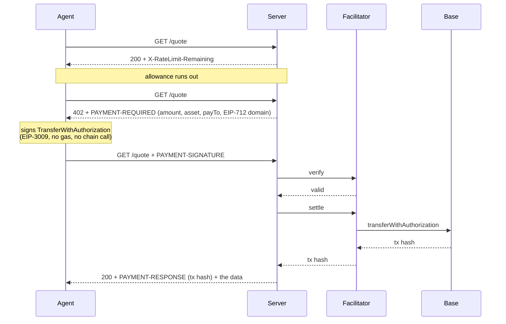

# A paid HTTP endpoint that agents can actually pay

An endpoint that is free up to a daily allowance and, past that line, answers
**402 with a payment challenge instead of a flat refusal**. The caller signs an
EIP-3009 transfer authorization, sends it back on the next request, and the same
request goes through. No API key, no account, no human in the loop.

Two files, standard library only on the server side.

- `server.py` — the paid endpoint: challenge, verify, settle, receipt.
- `agent.py` — a client that spends the free allowance, reads the challenge,
  signs, and retries.

Extracted from the agent layer of [helprentdanang.com](https://helprentdanang.com/for-agents/),
reduced to one endpoint.

## The flow



## Run it

```bash
pip install eth-account          # the agent needs it; the server only for dry-run verification
python server.py                 # dry run: signatures verified locally, nothing settled
python agent.py --key 0x<throwaway private key>
```

Real output from a dry run, free allowance set to 2:

```
call 1: 200, free calls left: 1
call 2: 200, free calls left: 0
call 3: 402 — allowance spent

challenge: 10000 units of 0x833589fCD6eDb6E08f4c7C32D4f71b54bdA02913
           on eip155:8453 to 0x000000000000000000000000000000000000dEaD
           discovery: {"type": "http", "method": "GET", "queryParams": {"district": "string, optional"}}
  signed as 0x1d18d2d1a23B20E4B8f576feAD1b0eF805808811

retry with payment: 200
receipt: success=True payer=0x1d18d2d1a23B20E4B8f576feAD1b0eF805808811 — DRY RUN, nothing settled
```

To settle for real, point it at a facilitator:

```bash
FACILITATOR_URL=https://api.cdp.coinbase.com/platform/v2/x402 \
FACILITATOR_API_KEY=... \
X402_PAY_TO=0xYourReceivingAddress \
python server.py
```

## What it refuses

`python test_guards.py` against a running server, all six verified:

```
[ok] a valid payment is accepted: 200
[ok] the same authorization cannot be replayed: 402 authorization nonce already used
[ok] the wrong amount is refused: 402 authorization is for the wrong amount
[ok] a payment to someone else is refused: 402 authorization pays someone else
[ok] a signature that does not match the payer is refused: 402 signature does not match the stated payer
[ok] a malformed header is a 402, not a 500: PAYMENT-SIGNATURE is not base64 JSON
```

## The decisions worth arguing about

**No private key on the application server.** The facilitator is the only party
that needs one, and it cannot change the amount or the recipient because both
are inside the signature it relays. The server signs nothing and holds nothing.

**Verify, then settle. Two calls, on purpose.** Settling a payload that would
not verify burns the facilitator's gas for an error nobody can explain
afterwards.

**A block of calls, not a call.** One payment buys thousands of requests.
Settling per request would put a chain write between an agent and every single
read, which is the wrong shape for anything an agent does in a loop.

**Amounts are strings.** The spec says so, and six-decimal USDC in a float is a
rounding bug waiting for the first amount that ends in a 5.

**The EIP-712 domain comes from the challenge, never from a local constant.**
The name and version belong to the token contract. Wrong ones produce a
signature that verifies against nothing while looking like the client's fault.

**Discovery lives inside the 402.** There is no `/.well-known/x402` in the
specification. The `bazaar` extension is how a paid endpoint describes its own
call shape so a facilitator that finds the challenge learns more than the price.

**Header values are base64 with no newlines.** `b64encode` does not wrap;
`encodebytes` does, and a newline inside a header value is a request-splitting
bug, not a formatting quirk.

## What this does not do

- **It is not production.** Allowance, credit and spent nonces live in process
  memory. A restart forgets every payment; two workers do not share state.
- **It does not check that the payer can pay.** Dry-run mode recovers the signer
  and validates the authorization. It does not read balances or allowances, and
  it does not spend anything on chain. Only the facilitator does that.
- **One rail.** EVM and the `exact` scheme. No Solana, no other schemes.
- **No refunds, no disputes, no reconciliation.** A settlement that times out
  halfway is not recovered here; in a real deployment that is the hard part.
- **The data is illustrative.** The endpoint returns a made-up rent figure. This
  repository is about the payment protocol, not about the data behind it.

## Licence

MIT.
