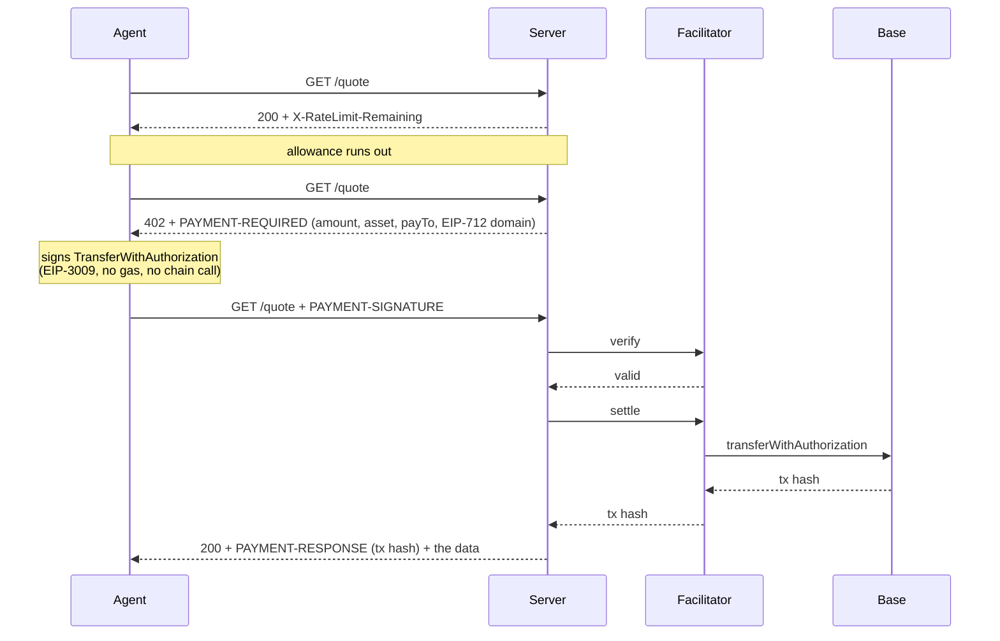

# A paid HTTP endpoint that agents can actually pay

An endpoint that is free up to a daily allowance and, past that line, answers
**402 with a payment challenge instead of a flat refusal**. The caller signs an
EIP-3009 transfer authorization, sends it back on the next request, and the same
request goes through. No API key, no account, no human in the loop.

One challenge offers two rails: USDC on Base through any x402 facilitator, and
USDC on [Arc](https://arc.io) through Circle Gateway nanopayments. The client
picks the chain it already holds funds on.

Standard library only on the server side.

- `server.py` is the paid endpoint: challenge, verify, settle, receipt.
- `agent.py` is a client that spends the free allowance, reads the challenge,
  signs for the rail it picks, and retries.
- `gateway_deposit.py` funds a payer's Circle Gateway balance on Arc, the one
  on-chain step the Arc rail needs.

Extracted from the agent layer of [helprentdanang.com](https://helprentdanang.com/for-agents/),
reduced to one endpoint.

## The flow



## Run it

```bash
pip install eth-account          # the agent needs it; the server only for dry-run verification
python server.py                 # dry run: signatures verified locally, nothing settled
python agent.py --key 0x<throwaway private key>
```

Real output from a dry run, free allowance set to 2:

```
call 1: 200, free calls left: 1
call 2: 200, free calls left: 0
call 3: 402 — allowance spent

challenge: 10000 units of 0x833589fCD6eDb6E08f4c7C32D4f71b54bdA02913
           on eip155:8453 to 0x000000000000000000000000000000000000dEaD
           discovery: {"type": "http", "method": "GET", "queryParams": {"district": "string, optional"}}
  signed as 0x1d18d2d1a23B20E4B8f576feAD1b0eF805808811

retry with payment: 200
receipt: success=True payer=0x1d18d2d1a23B20E4B8f576feAD1b0eF805808811 — DRY RUN, nothing settled
```

To settle for real, point it at a facilitator:

```bash
FACILITATOR_URL=https://api.cdp.coinbase.com/platform/v2/x402 \
FACILITATOR_API_KEY=... \
X402_PAY_TO=0xYourReceivingAddress \
python server.py
```

## USDC on Arc, through Circle Gateway

Arc is Circle's L1, and USDC is its gas token. On the day Arc mainnet opened
(2026-09-16) no general x402 facilitator settled it; Circle Gateway did, with no
API key. Gateway runs a batched flavour of the `exact` scheme, and three things
differ from Base:

1. **The payer signs for GatewayWallet, not for the token.** The EIP-712 domain
   is `GatewayWalletBatched` version `1`, and `verifyingContract` is the
   GatewayWallet contract. The challenge carries all three in `extra`; the
   server reads them from Gateway's `/v1/x402/supported` rather than hardcoding
   them.
2. **The authorization lives at least seven days.** Gateway refuses anything
   shorter, so the Arc entry has `maxTimeoutSeconds` of 604900 where Base has 60.
3. **Nothing goes on chain per call.** The payer deposits USDC into Gateway once.
   Each payment after that is a signature; Gateway's `/settle` verifies it, locks
   the amount, and credits the seller in a batched settlement on Arc. The receipt
   carries Gateway's transfer id instead of a transaction hash.

```bash
ARC_ENABLED=1 X402_PAY_TO=0xYourReceivingAddress python server.py

# the payer, once: approve + deposit on Arc mainnet (asks before sending)
DEPOSITOR_KEY=0x... python gateway_deposit.py --amount 1
python gateway_deposit.py --balance 0xPayerAddress

# then every payment is a signature
PAYER_KEY=0x... python agent.py --network eip155:5042
```

The challenge entry, as the server builds it from Gateway's own listing:

```json
{
  "scheme": "exact",
  "network": "eip155:5042",
  "amount": "10000",
  "asset": "0x3600000000000000000000000000000000000000",
  "payTo": "0xYourReceivingAddress",
  "maxTimeoutSeconds": 604900,
  "extra": {
    "name": "GatewayWalletBatched",
    "version": "1",
    "verifyingContract": "0x77777777dcc4d5a8b6e418fd04d8997ef11000ee"
  }
}
```

Gateway's answers to signatures from a fresh key with no deposit, measured
against mainnet:

```
signed as the challenge says                -> insufficient_balance
same payload, one signature byte changed    -> invalid_signature
signed with the USDC contract as the domain -> invalid_signature
validBefore one hour out                    -> authorization_validity_too_short
```

A correct signature gets past the signature check and stops at the balance.

Things that cost time and are not in Circle's quickstart:

- Gateway answers **403 to urllib's default User-Agent** (`Python-urllib/3.x`),
  and so do many bot filters. Every request here names its own.
- `paymentPayload.resource` is optional in the x402 spec and **required by
  Gateway**, with `url`, `description` and `mimeType` all present. The server
  fills it in when a client leaves it out; it is not covered by the signature.
- The `0x3600…0000` USDC contract on Arc is the ERC-20 view of the native gas
  balance: 6 decimals there, 18 in the native balance. Its own EIP-712 name is
  `USDC`, not `USD Coin`, which matters only if you sign plain EIP-3009 against
  the token.
- Arc silently drops transactions with `maxFeePerGas` under 20 gwei.
  `gateway_deposit.py` never goes below it.

ARC_DRY_RUN=1 verifies Arc signatures locally instead of calling Gateway.

## Live on Arc mainnet

The same rail runs in production on the
[HelpRent Da Nang agent API](https://helprentdanang.com/for-agents/): a REST API
and an MCP server over long-term rentals in Da Nang. Past 600 free calls a day
both answer 402, and the challenge offers USDC on Base, on Solana and on Arc.

```bash
# over the free line:
curl -si -A x402-demo https://helprentdanang.com/api/v1/listings/?city=danang \
  | grep -i '^payment-required' | cut -d' ' -f2 | base64 -d | jq '.accepts[].network'
"eip155:8453"
"solana:5eykt4UsFv8P8NJdTREpY1vzqKqZKvdp"
"eip155:5042"
```

The production code is a Django service in a private repository; the Arc rail
there does what `server.py` does here, with persistence, replay protection in
the database and a log of every settlement attempt.

Paying it with `agent.py` from a fresh key and no Gateway deposit, 2026-09-16:

```
status: 402
payment-response: {'success': False, 'network': 'eip155:5042', 'errorReason': 'insufficient_balance'}
```

## What it refuses

`python test_guards.py` against a running server, all six verified:

```
[ok] a valid payment is accepted: 200
[ok] the same authorization cannot be replayed: 402 authorization nonce already used
[ok] the wrong amount is refused: 402 authorization is for the wrong amount
[ok] a payment to someone else is refused: 402 authorization pays someone else
[ok] a signature that does not match the payer is refused: 402 signature does not match the stated payer
[ok] a malformed header is a 402, not a 500: PAYMENT-SIGNATURE is not base64 JSON
```

## The decisions worth arguing about

**No private key on the application server.** The facilitator is the only party
that needs one, and it cannot change the amount or the recipient because both
are inside the signature it relays. The server signs nothing and holds nothing.

**Verify, then settle. Two calls, on purpose.** Settling a payload that would
not verify burns the facilitator's gas for an error nobody can explain
afterwards.

**A block of calls, not a call.** One payment buys thousands of requests.
Settling per request would put a chain write between an agent and every single
read, which is the wrong shape for anything an agent does in a loop.

**Amounts are strings.** The spec says so, and six-decimal USDC in a float is a
rounding bug waiting for the first amount that ends in a 5.

**The EIP-712 domain comes from the challenge, never from a local constant.**
The name and version belong to the token contract. Wrong ones produce a
signature that verifies against nothing while looking like the client's fault.

**Discovery lives inside the 402.** There is no `/.well-known/x402` in the
specification. The `bazaar` extension is how a paid endpoint describes its own
call shape so a facilitator that finds the challenge learns more than the price.

**Header values are base64 with no newlines.** `b64encode` does not wrap;
`encodebytes` does, and a newline inside a header value is a request-splitting
bug, not a formatting quirk.

## What this does not do

- **It is not production.** Allowance, credit and spent nonces live in process
  memory. A restart forgets every payment; two workers do not share state.
- **It does not check that the payer can pay.** Dry-run mode recovers the signer
  and validates the authorization. It does not read balances or allowances, and
  it does not spend anything on chain. Only the facilitator does that.
- **Two EVM rails.** Base through a facilitator, Arc through Circle Gateway. No
  Solana here, no other schemes.
- **It does not withdraw.** Gateway credits the seller inside Gateway; moving it
  out is a signed withdrawal by the owner of `payTo`, done outside this repo.
- **No refunds, no disputes, no reconciliation.** A settlement that times out
  halfway is not recovered here; in a real deployment that is the hard part.
- **The data is illustrative.** The endpoint returns a made-up rent figure. This
  repository is about the payment protocol, not about the data behind it.

## Licence

MIT.
